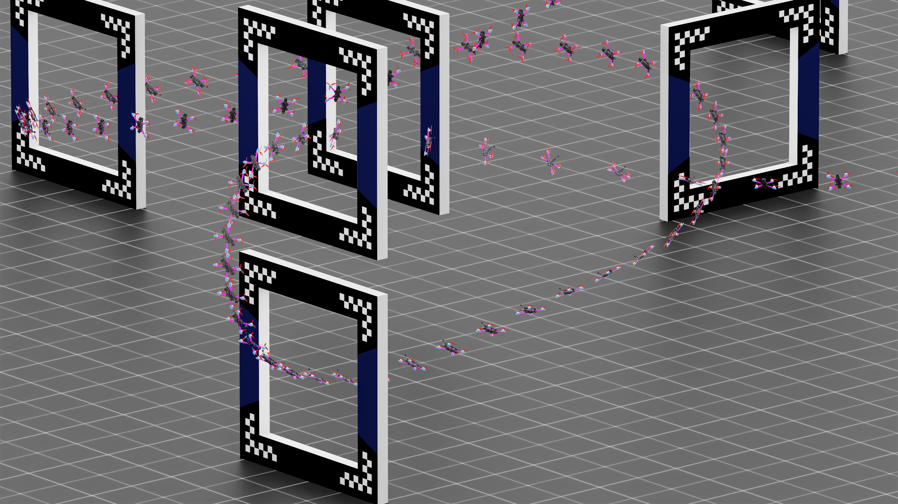

---

# Isaac Drone Racer

[](https://docs.isaacsim.omniverse.nvidia.com/latest/index.html)
[](https://isaac-sim.github.io/IsaacLab/)
[](https://docs.python.org/3/whatsnew/3.10.html)
[](https://github.com/kousheekc/isaac_drone_racer/blob/master/.github/workflows/pre-commit.yaml)
[](https://opensource.org/licenses/BSD-3-Clause)

**Isaac Drone Racer** is an open-source simulation framework for autonomous drone racing, developed on top of [IsaacLab](https://github.com/isaac-sim/IsaacLab). It is designed for training reinforcement learning policies in realistic racing environments, with a focus on accurate physics and modular design.

Autonomous drone racing is an active area of research. This project builds on insights from that body of work, combining them with massively parallel simulation to train racing policies within minutes — offering a fast and flexible platform for experimentation and benchmarking.

You can watch the related video here: [https://youtu.be/wLTYtpEUEEk](https://youtu.be/wLTYtpEUEEk)

## Features

Key highlights of the Isaac Drone Racer project:

1. **Accurate Physics Modeling** — Simulates rotor dynamics, aerodynamic drag, and power consumption to closely match real-world quadrotor behavior.
2. **Low-Level Flight Controller** — Built-in attitude and rate controllers.
3. **Manager-Based Design** — Modular architecture using IsaacLab's [manager based architecture](https://isaac-sim.github.io/IsaacLab/main/source/refs/reference_architecture/index.html#manager-based).
4. **Onboard Sensor Suite** — Includes simulated fisheye camera, IMU and collision detection.
5. **Track Generator** — Dynamically generate custom race tracks.
6. **Logger and Plotter** — Integrated tools for monitoring and visualizing flight behavior.

### Prerequisites
- Workstation capable of running Isaac Sim (see [link](https://github.com/isaac-sim/IsaacSim?tab=readme-ov-file#prerequisites-and-environment-setup))
- [Git](https://git-scm.com/downloads) & [Git LFS](https://git-lfs.com)
- [Conda](https://www.anaconda.com/docs/getting-started/miniconda/install) for local installation or [Docker](https://docs.docker.com/engine/install/ubuntu/) with [NVIDIA Container Toolkit](https://docs.nvidia.com/datacenter/cloud-native/container-toolkit/latest/install-guide.html)

## Requirements
This project has been developed and tested with:

- **Isaac Sim 5.1**
- **Isaac Lab 2.3.2**
- **Python 3.10**
- **Ubuntu 22.04 (x64)**

## Setup
1. Follow the [Isaac Lab pip installation instructions](https://isaac-sim.github.io/IsaacLab/main/source/setup/installation/pip_installation.html), with the following modifications:
- After cloning the Isaac Lab repository:
```bash
git clone git@github.com:isaac-sim/IsaacLab.git
```

- Checkout the `v2.3.2` release tag:
```bash
cd IsaacLab
git checkout v2.3.2
```

2. Clone Isaac Drone Racer:
```bash
git clone https://github.com/kousheekc/isaac_drone_racer.git
```

3. Install the modules in editable mode
```bash
cd isaac_drone_racer
pip3 install -e .
```

## Usage
Tasks are registered as standard Gym environments and training/evaluation are powered by the [skrl](https://github.com/Toni-SM/skrl) library. Two training modes are available:

| Mode | Task IDs | Actor input | Critic input |
|------|----------|-------------|--------------|
| **Asymmetric actor-critic** (camera) | `Isaac-Drone-Racer-v0` / `Isaac-Drone-Racer-Play-v0` | FPV camera (64×64 grayscale) + IMU | Privileged ground-truth state |
| **Ground-truth only** (no camera) | `Isaac-Drone-Racer-NoCam-v0` / `Isaac-Drone-Racer-NoCam-Play-v0` | Full ground-truth state | Same as actor |

### Asymmetric Actor-Critic (Camera + IMU)

This mode trains a deployable policy that uses only onboard sensors (FPV camera + IMU) at inference time. During training, the critic has access to privileged ground-truth state to produce better value estimates — a technique known as asymmetric actor-critic. Because every environment renders a 64×64 camera frame each step, this mode is significantly more GPU-intensive.

```bash
# Train
python3 scripts/rl/train.py --task Isaac-Drone-Racer-v0 --headless --num_envs 512

# Play
python3 scripts/rl/play.py --task Isaac-Drone-Racer-Play-v0 --num_envs 1
```

Checkpoints are saved under `logs/skrl/drone_racer/`.

### Ground-Truth Only (No Camera)

This mode uses the full simulator state (position, orientation, velocity, target direction) as observations for both actor and critic. The camera is disabled entirely, making this much faster to train — suitable for rapid iteration on reward shaping, dynamics tuning, or controller design.

```bash
# Train
python3 scripts/rl/train.py --task Isaac-Drone-Racer-NoCam-v0 --headless --num_envs 4096

# Play
python3 scripts/rl/play.py --task Isaac-Drone-Racer-NoCam-Play-v0 --num_envs 1
```

Checkpoints are saved under `logs/skrl/drone_racer_nocam/`.

> [!NOTE]
> You can pass additional CLI arguments supported by the [AppLauncher](https://isaac-sim.github.io/IsaacLab/main/source/tutorials/00_sim/launch_app.html). Additionally since IsaacLab supports the [Hydra Configuration System](https://isaac-sim.github.io/IsaacLab/main/source/features/hydra.html), task-specific parameters can be adjusted from CLI.
> For example, to disable the motor model during training:
> ```bash
> python3 scripts/rl/train.py --task Isaac-Drone-Racer-NoCam-v0 --headless --num_envs 4096 env.actions.control_action.use_motor_model=False
> ```

## Next Steps

- [ ] **Data-driven aerodynamic model pipeline** - integrate tools for data driven system identification, calibration and include the learned aerodynamic forces into the simulation environment.
- [ ] **Power consumption model**  - incorporate a detailed power model that accounts for battery discharge based on current draw.
- [x] **Policy learning using onboard sensors** - asymmetric actor-critic training with FPV camera + IMU actor and privileged ground-truth critic.


## Troubleshooting
- When running a workflow script, ensure that the IsaacLab conda environment is active:
```bash
conda activate env_isaaclab
```
- When launching Isaac Sim for the first time, it may take a significant amount of time to load (potentially 10 minutes). This is normal, please be patient.

## Acknowledgement

- **Kaufmann, E., Bauersfeld, L., Loquercio, A., Müller, M., Koltun, V., & Scaramuzza, D.** (2023).
  *Champion-level drone racing using deep reinforcement learning*.
  [https://doi.org/10.1038/s41586-023-06419-4](https://doi.org/10.1038/s41586-023-06419-4)

- **Rudin, N., Hoeller, D., Reist, P., & Hutter, M.** (2022).
  *Learning to Walk in Minutes Using Massively Parallel Deep Reinforcement Learning*.
  [arXiv:2109.11978](https://arxiv.org/abs/2109.11978)

- **Ferede, R., De Wagter, C., Izzo, D., & de Croon, G. C. H. E.** (2024).
  *End-to-end Reinforcement Learning for Time-Optimal Quadcopter Flight*.
  [https://doi.org/10.1109/ICRA57147.2024.10611665](https://doi.org/10.1109/ICRA57147.2024.10611665)

## License
This project is licensed under the BSD 3-Clause License - see the [LICENSE](https://github.com/kousheekc/isaac_drone_racer/blob/master/LICENSE) file for details.

## Contact
Kousheek Chakraborty - kousheekc@gmail.com

Project Link: [https://github.com/kousheekc/isaac_drone_racer](https://github.com/kousheekc/isaac_drone_racer)

If you encounter any difficulties, feel free to reach out through the Issues section. If you find any bugs or have improvements to suggest, don't hesitate to make a pull request.
